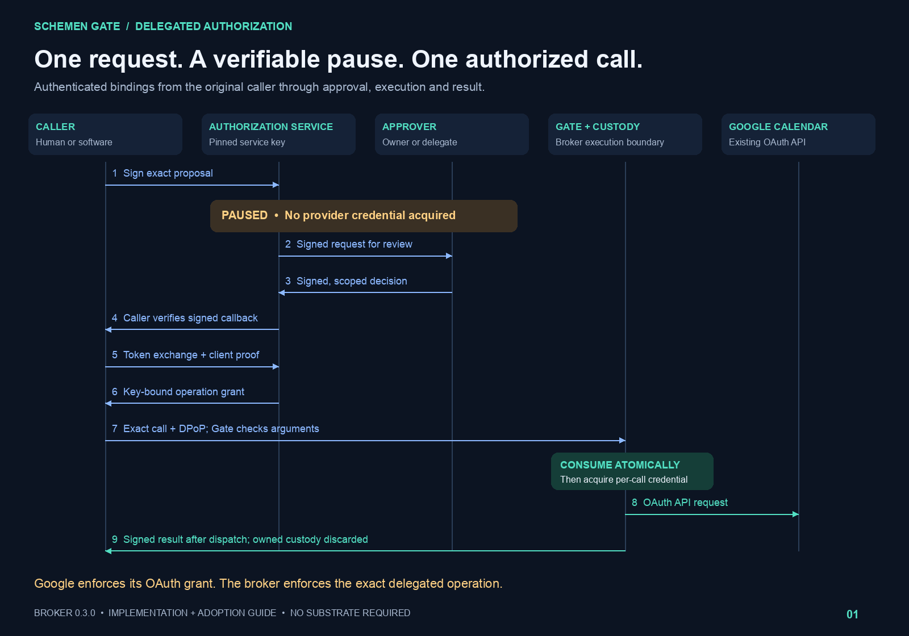
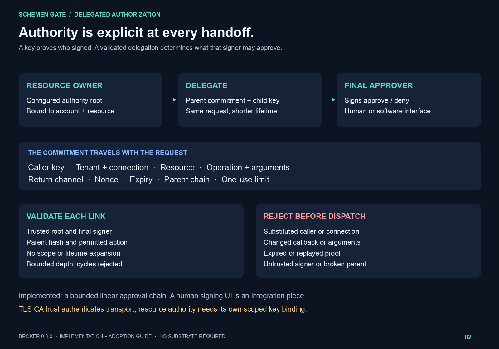
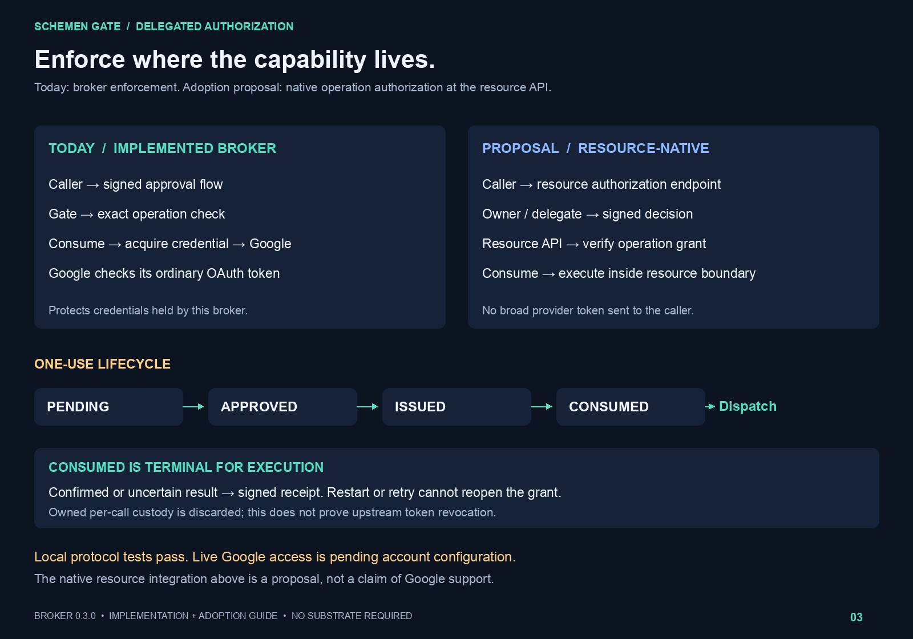

# Authenticated delegation — display kit

**One request. A verifiable pause. One authorized call.**

An agent proposes an exact operation. An authorized human or software principal
approves it. Authenticated bindings carry that decision back to the caller and
forward to the execution boundary, where the grant is checked and consumed
before a per-call credential is acquired.

## Display boards

Use PNG for direct display and SVG for scalable layout in a site or presentation.
These are logical roles; authorization, Gate and custody may share a deployment.
The diagrams describe the implemented profile, not a completed live Google test.

### 1. Authenticated swimlanes



[Scalable SVG](01-authenticated-swimlanes.svg)

Talk track: The pause is an authorization state, not an agent's promise to wait.
Approval commits to the original caller and operation. Only the matching caller
can redeem it, and the actual call must still pass the Gate before dispatch.

### 2. Delegation and exact bindings



[Scalable SVG](02-delegation-and-bindings.svg)

Talk track: A valid signature identifies a key. The configured resource authority
and verified parent chain determine what that key may authorize. Each hop must
preserve or narrow the authority. A human signing UI remains an integration piece.

### 3. Resource boundary and one-use lifecycle



[Scalable SVG](03-resource-boundary.svg)

Talk track: The broker governs credentials in its custody today. Native resource
adoption would put the exact-operation check inside the provider's enforcement
path. That is a proposal; Google currently receives an ordinary OAuth API request
from this adapter. Consumed grants cannot be reopened after uncertain dispatch.

## Editable sequence source

```mermaid
sequenceDiagram
    autonumber
    actor C as Caller (human or software)
    participant A as Authorization service
    actor O as Owner or authorized delegate
    participant G as Gate and per-call custody
    participant R as Google Calendar API
    C->>A: Signed proposal: caller, connection, exact call, nonce, channel, expiry
    A->>A: Authenticate bindings and persist pending
    A-->>C: Signed pending acknowledgement
    Note over A,G: PAUSE: no provider credential acquired
    O->>A: Authenticated review request
    A-->>O: Signed original proposal
    O->>A: Signed decision and optional delegation chain
    A->>A: Verify trusted root, each parent link and final signer
    alt Denied or expired
        A-->>C: Signed denial when decided; no execution grant
    else Approved
        A-->>C: Signed callback bound to original caller and request
        C->>C: Verify pinned service key, nonce and request commitment
        C->>A: Token exchange + client assertion + DPoP
        A-->>C: Key-bound exact-operation grant
        C->>G: Exact call + grant + fresh DPoP
        G->>G: Verify actual call; atomically consume authorization
        G->>G: Acquire and seal per-call provider credential
        G->>R: Ordinary Google OAuth API request
        R-->>G: Provider response or uncertain outcome
        G->>G: Discard owned per-call custody
        G-->>C: Signed result and custody receipt
        C->>G: Replay after restart
        G-->>C: Reject; no further dispatch
    end
```

## Editable lifecycle source

```mermaid
stateDiagram-v2
    [*] --> Pending: Authenticated proposal
    Pending --> Approved: Valid owner or delegated approval
    Pending --> Denied: Valid denial
    Pending --> Expired: Lifetime ends
    Approved --> Issued: Bound token exchange
    Approved --> Revoked: Authorized cancellation
    Issued --> Revoked: Authorized cancellation before consumption
    Issued --> Consumed: Gate passes and atomic consume succeeds
    Consumed --> Confirmed: Provider confirms; result recorded
    Consumed --> Unknown: Failure or cancellation leaves uncertain outcome
    Confirmed --> [*]
    Unknown --> [*]
    Denied --> [*]
    Revoked --> [*]
    Expired --> [*]
```



This lifecycle is conceptual: confirmed/unknown are result outcomes, not new
execution authority. Expiration also prevents use after approval or issuance.
Neither a timeout nor an uncertain outcome creates a fresh execution grant.

## Claim boundaries for display

- Implemented: authenticated request, approval chain, callback, token exchange,
  exact-call Gate, durable atomic consumption and signed results.
- Locally tested: protocol behavior and Calendar custody with simulated provider
  transport. The implementation is not a blanket production-readiness claim.
- Pending: authenticated live Google acceptance and operator account configuration.
- Proposed: resource-native verification of these operation grants.
- Destruction: owned per-call custody; not provider revocation or universal erasure.

See the [resource-owner guide](../../RESOURCE_OWNER_GUIDE.md),
[protocol contract](../../DELEGATED_AUTHORIZATION.md), and
[Google acceptance procedure](../../GOOGLE_CALENDAR_ACCEPTANCE.md).

## Regeneration

`render.py` generates the three SVG and PNG pairs using Pillow and local Arial
fonts on macOS. SVG exports contain editable text and vector shapes; no external
image or script resources are loaded. PNG previews are 1600 × 1120 pixels.

```sh
python services/credential-broker/docs/display/render.py
```
